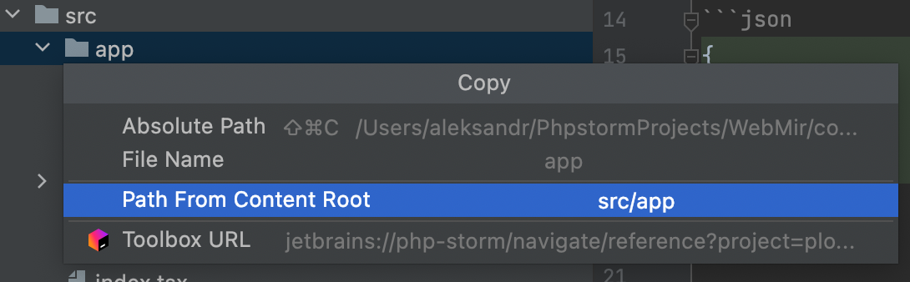

# Template Generator

* `{{dashCase name}}` - dash-case
* `{{camelCase name}}` - camelCase
* `{{kebabCase name}}` - kebab-case
* `{{pascalCase name}}` - PascalCase

https://github.com/SBoudrias/Inquirer.js/blob/main/packages/inquirer/README.md#prompt-types

```shell
npm i plop -D
```

```json
{
  "scripts": {
    "generate": "cd plop && plop"
  }
}
```

> node >= 16

copy path to custom dir

<p align="center" style="text-align:center">
    
</p>
